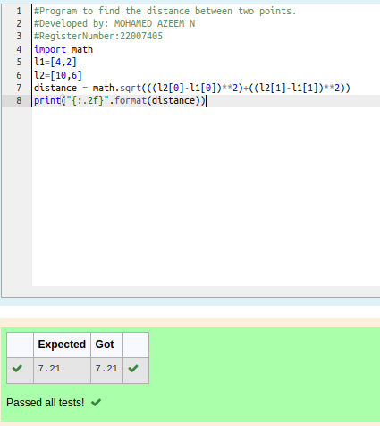

# DISTANCE-BETWEEN-TWO-POINTS

## AIM:

To write a python program to find the distance two 2 points

## ALGORITHM:

### Step 1: 

initialise the program with import math

### Step 2: 

get input from the user

### Step 3: 

Substitute the values in the distance formula  

### Step 4: 

display the output using print()

### Step 5: 

End of the program

### PROGRAM:
```python  
#Program to find the distance between two points.
#Developed by: MOHAMED AZEEM N
#RegisterNumber:22007405
import math
l1=[4,2]
l2=[10,6]
distance = math.sqrt(((l2[0]-l1[0])**2)+((l2[1]-l1[1])**2))
print("{:.2f}".format(distance))
```
### OUTPUT:



### RESULT:
Thus distance between two points executed successfully